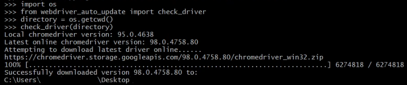

# webdriver_auto_update
A program to check existing local chromedriver version and automatically downloads the latest available version online.

# Program Functionality
- Checks local chromedriver driver version on your computer and compares it with the latest version available online.
- The latest online version/release will be downloaded if it does not match your local version.
- If no local chromedriver executable file is found in the specified folder path, it will be downloaded automatically to that particular folder.

## Pre-requisites:
1. Download Google Chrome
2. pip install selenium

## Installation
- Make sure you have Python installed in your system.
- Run the following to install:

``` 
pip install webdriver-auto-update
```

## Example
```
# webdriver_auto_update.py
from webdriver_auto_update import check_driver
## Make sure to pass in the folder used for storing and  downloading chromedriver executable
check_driver('directory/to/store/chromedriver')
```



## Note
- The objective of this program is to reduce redundancy of searching and downloading the updated version of chrome driver to the OpenSource community.
- Intended to be used in Selenium projects, browser testing or web automation.
